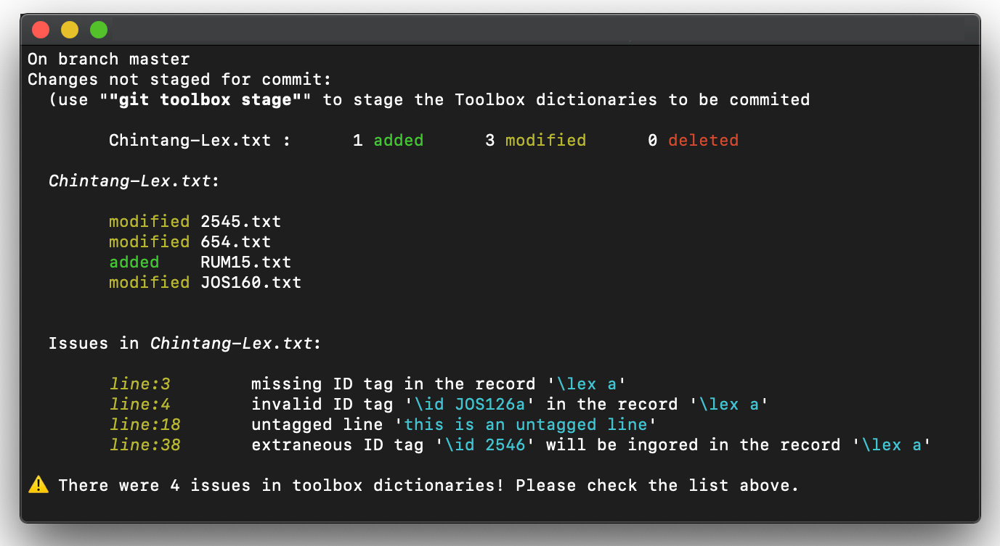

# Git-toolbox

Git extension for integrating [Field Linguist's Toolbox](https://software.sil.org/toolbox/)
with git, focusing on user experience, reliability and performance. 

*Disclaimer*: this is alpha-quality software that has not been sufficiently tested yet! It can 
contain bugs and it might cause data loss. See 
[current status](#current-status-and-reliability-considerations).



Table of contents:

*   [Overview](#overview)
*   [Current status and reliability considerations](#current-status-and-reliability-considerations)
*   [Installation](#overview)
*   [Configuration](#configuration)
*   [Planned features](#planned-features)
*   [Acknowledgments](#acknowledgments)
*   [Contributing](#contributing)
*   [License](#license)

## Overview

[Field Linguist's Toolbox](https://software.sil.org/toolbox/) is a venerable software tool
for managing and analysing fieldwork data from SIL that still enjoys tremendeous popularity
for language documentation work. Arguably one of the reasons why Toolbox aged so well is 
because it uses a humanly-readable plain text format that closely mimics linguistic glosses. 
This makes Toolbox data easy to process and manipulate and also enables advanced setups
based on modern version control tools. By combining Toolbox with a modern VCS such as git, 
teams can enjoy collaborative editing, annotated edit histories and all the power of the
branching workflows. 

At the same time, Toolbox integration with VCS is not without issue. Modern version control
systems treat each file as a separate entity with an isolated edit history. They analyse which
edits were done to different lines of a file, which enables them to seamlessly merge simultaneous
changes by multiple people, as long as they were done to different parts of a file. A Toolbox 
project, however, cenrally depends on a set of dictionary files. The dictionaries are global
repositories for information such as lexical entries, word parsing rules etc. They are large
files that can contain thousands upon thousands of entries and are modified very frequently.
A VCS such as git is ill-equipped to analyse changes to these files and gets confused by 
the large amount of small simultaneus changes that tend to mixed up. It ends up generating 
merge conflicts and askign the user to sort this out. Resolving such conflicts can be very 
time consuming and error-prone and the edit history is left in a messy state. 

**`Git-toolbox`** is a git extension that attempts to address these issues. Since the issue is that
the VCS can't properly handle the large, monolitic dictionary files, `git-toolbox` stores them in
the repository as separate dictionary entries. This means that each entry in a dictionary is
represented as a distinct file. Rather than seeign one large file with many changes, git sees many
small files that are only rarely edited simultaneously. Modifications to dictionary entries can be
tracked and viewed separately, edit history becomes easy to follow and understand, and difficult
merge conflicts are mostly the thing of the past (even if they occur, they are limited to
individual entry files and are trivial to deal with). `git-toolbox` acts as a layer between the
Toolbox software and the git repository, transforming the files between representations in the
background, transparently to the user. 

`git-toolbox` is written in Rust with focus on user experience, reliability and performance. On
a modern machine with a solid state hard drive, it takes just a split second to analyse changes 
in a large real-world language corpus containing over ten thousands of dictionary entries. 

## Current status and reliability considerations

This is alpha-quality software that has not been sufficiently tested. It can contain bugs and 
it might cause data loss. Some faetures (e.g. the structure of the managed directories) may be
changed without notice. 

We do not recommend for this softwaare to be used in production environment. If you use it, please
make sure to double-check after each operation and maintain regular backups. `git-toolbox` will not
overwrite your git history and it will not manipulate the git repository beyond the staging areas
so your git history should be safe. 


## Installation

Currently, the best way to install git-toolbox is to compile it from source. Install 
[Rust](https://www.rust-lang.org/tools/install), download or clone this repository and run

```terminal
cargo install --path .
```

`git-toolbox` has been mostly tested under macOS. It should compile and run on Linux and Windows. 
You are more then welcome to be a tester! 


## Usage

`git-toolbox` is a command line tool. It offers a number of user-friendly commands that mimick the 
usual git operation. The tool will try to provide informative messages how to solve common
operational issues. It is designed to be used from within a working directory of an existing
git repository. 

### Commands 

```terminal
git toolbox setup
```

Configures the git repository by setting the internal git hooks. This ensures `git-toolbox` can
operate correctly. Setting up the repository requires a valid `git-toolbox` 
[configuration](#configuration).

```terminal
git toolbox status
```

Shows the current status of the managed Toolbox dictionaries. This includes changes made to 
dictionary entries and well as issues detected when analysing the dictionary contents. This command
is analogous to `git add`

```terminal
git toolbox stage
```

Marks the changes to the managed Toolbox dictionaries to be added to the next git commit. This
command is analogous to `git add`


```terminal
git toolbox reset
```

Discards the local changes made to the Toolbox dictionaries and reverts them to the latest 
known status. This command is analogous to `git reset`


```terminal
git toolbox --help
```

`git-toolbox` is equipped with an internal help system that will show available commands and their
usage. 

### Structure of managed folders

`git-toolbox` operates by decomposing Toolbox dictionaries into separate entries and storing
them in the git repository as individual files. The names of the files will correspond to the 
unique ID or the label of the dictionary entry. They will be stored in a directory that has the
same name as the dictionary file, but with `.contents` added. For example, if your dictionary 
`Lex.txt` contains entries with ids `15`, `18` and `1235`, the following will appear in your
git repository:

```terminal

        Lex.contents
        ├── 15.txt
        ├── 18.txt
        └── 1235.txt

```

Actually, the story is a bit more complicated. Since a dictionary can contain many thousands
of entries, the above aproach would create very large directories. This is now what filesystems
and platforms such as GitHub/GitLab are designed to deal with. Also, navigating such directories
can become a pain. 

Instead, `git-toolbox` will generate some intermediate directories to store the files in. This 
reduces the number of files that end up in the same folder. To ease navigation and discoverability,
these folders are named after the prefix of the entries they contain. This way you can directly
see which entries will be where. The result is somethign like this:

```terminal

        Lex.txt
        ├── ad
        │   └── hi
        │       └── adhi.txt
        ├── la
        │   └── su
        │       └── lasun.txt
        ├── na
        │   ├── ch
        │   │   └── nachi_ma.txt
        │   └── d_
        │       └── nad.txt
        ├── su
        │   └── s_
        │       └── sus.txt
        └── um
            ├── er
            │   └── umer.txt
            ├── es
            │   └── umes.txt
            ├── ik
            │   └── umika.txt
            └── ma
                └── ummakussi.txt
```
You can find the entry in the tree by following the prefix. 

### Namespaces

`git-toolbox` supports the concept of entry namespacing. Here, one can maintain different groups of
entry IDs. These groups can be dedicated to separate users. For example, user `AWA` will use entry
IDs in form of `AWA1`, `AWA2`, ... while user `KK` will use `KK1`, `KK2`, ... . This allows the
users to create new entries without getting in conflict with each other, which is very useful when a
new morpheme or root is encountered and needs to be analysed.  These kind of IDs are called
*private*.

In addition to private per-contributor ID namespaces, there is also a shared global namespace. 
This namespace contains "stabilised" entries that are less likely to change and will be used by
all users. 

`git-toolbox` will store namespaced IDs in the `private` directory of the managed `.contents` 
folder and the global IDs in the `public` folder. You can opt-out from using namespaces by 
configuring the [ID specification regular expression](#configuration) accordingly. In this case
you will only get the `public` directory. 

## Configuration 

`git-toolbox` relies on user-provided configuration file to describe the Toolbox dictionaries and
their structure. The configuration file is a simple [TOML](https://en.wikipedia.org/wiki/TOML) 
file with the following contents:

```toml
    # I am a comment

    # This describes a dictionary
    [[dictionary]] 
    # What is it's name?
    name       = "Test Lexical Dictionary"
    # Where is it (relative to git project folder)?
    path       = "dictionaries/lexical.txt"
    # What is the toolbox tag that starts an entry? Its \lex
    record-tag = "lex"

    # Entries of this dictionary have unique IDs
    unique-id = true
    # The unique IDs are marked by the tag \id
    id-tag    = "id"
    # The regular expression that shows how IDs are formed
    # here we have a letter-only optional namespace prefix
    # followed by numeric ID (e.g. AWA134, ZK123, KA123, 1234)
    id-spec   = "(?P<namespace>[a-zA-Z]*)(?P<id>[0-9]+)"

    # This describes another dictionary
    [[dictionary]] 
    # What is it's name?
    name       = "Test Parsing Dictionary"
    # Where is it (relative to git project folder)?
    path       = "dictionaries/parsing.txt"
    # What is the toolbox tag that starts an entry? Its \lem
    record-tag = "lem"

    # Entries of this dictionary does not have unique IDs
    # The entry label \lem will be used instead to identify entries
    unique-id = false
```

Each time the configuration file changes (which should not be that often), you need to run

```terminal
    git toolbox setup
```

The tool will be able to detect when this is nessesary and will inform you with a diagnostics 
message. 

You can also use

```terminal
    git toolbox setup --init
```

to generate a first-time configuration and edit it. 


## Planned features 

Following features are planned for inclusion before the `git-toolbox` stabilizes:

* *Lifecycle management* 

  Support for controlled management of dictionary evolution. With lifecycle management, dictionary 
  entris are tagged by their their maturity status (e.g. `experimental`, `stable`, `retired`) and
  the entries thy evolve from (e.g. public entry `1234` superseeds the private entry `AWA231`). 
  Lifecycle management will allow greater control and overview over how the state of linguistic 
  analysis has developed over time, while preventing mistakes.

* *User management*

  Provide checks that the user who makes modifications is entitled to do so. Combined with
  lifecycle management, this will allow fine-grained control over changes to the Toolbox project. 


## Contributing

Contributions and suggestions are welcome! Feel free to open a pull request or start an issue. 

## Acknowledgments

*  The development of this software was sponsored by 
[LiRI - Linguistic Research Infrastructure](https://www.liri.uzh.ch/en.html)

## Citing

If you use this software in your project, we are thankful for a short note on your project website/
in your publications. If you want to cite this software, you may do it as so:

> T. Zakharko. 2020. `git-toolbox`, the git extension for integration with Field Linguist's Toolbox.
> https://github.com/git-toolbox-integration/git-toolbox


## License

Copyright 2020 Taras Zakharko.

Licensed under GNU GENERAL PUBLIC LICENSE Version 3. See `LICENSE` for the license text. Files in
the project may not be copied, modified, or distributed except according to those terms.

Use at your own risk. This software is provided as is, without warranty of any kind. Use of this
software does not entitle you to any support or other services. 


